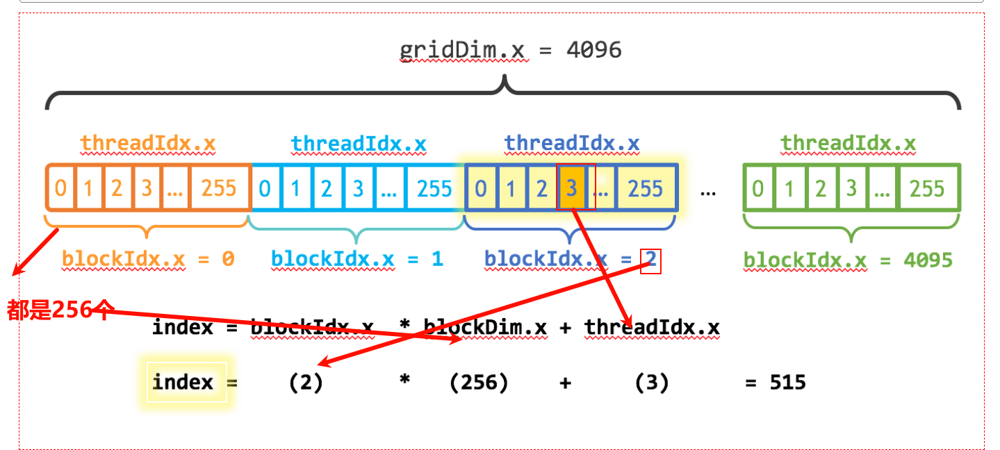

[An Even Easier Introduction to CUDA](ttps://developer.nvidia.com/blog/even-easier-introduction-cuda/)

线程 -> 并行的线程块 -> 网格(grid) -> 设备

```cpp
int numBlocks = (N + blockSize - 1) / blockSize; // 不丢失数据，向上取整的方法
```



搞不明白，为什么明明用了 GPU 计算，CPU 耗时 0.195s 而 GPU 耗时 1s 多。

[Intro to the Class - Intro to Parallel Programming](https://www.youtube.com/watch?v=F620ommtjqk&list=PLAwxTw4SYaPnFKojVQrmyOGFCqHTxfdv2)